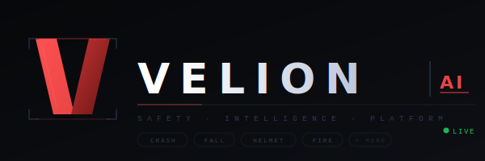

<div align="center">
  
</div>

# Velion — AI Surveillance Platform

Velion is an intelligent surveillance platform that uses pluggable computer vision models (YOLO, ONNX) to monitor live camera streams and uploaded video footage for real-time event detection.

**Bring your own model. Velion handles the rest.**

---

## Features

- **Live stream monitoring** — connect IP cameras via RTSP/HTTP or USB cameras (auto-detected)
- **Video file analysis** — upload MP4, AVI, MOV, MKV files up to 500 MB for retrospective analysis
- **Pluggable AI models** — upload any YOLOv8/v9/v10, YOLOv5, or ONNX model; Velion auto-detects classes
- **Incident detection** — configurable confidence thresholds, cooldown periods, and alert hold frames
- **Per-camera recording** — automatic 1-hour segment rotation with configurable retention
- **Stream persistence** — cameras reconnect automatically on restart, preserving their slot positions
- **Analytics dashboard** — per-stream incident counts and detection class breakdowns
- **Security headers** — CSP, X-Frame-Options, nosniff out of the box

**Use cases:** Road accidents · Construction safety · PPE compliance · Patient falls · Theft detection · Fire & smoke · Crowd monitoring · Any YOLO model

---

## Prerequisites

- **Python 3.10+** (for native installs)
- **Docker + Docker Compose** (for Docker installs)
- **NVIDIA GPU + [nvidia-container-toolkit](https://docs.nvidia.com/datacenter/cloud-native/container-toolkit/install-guide.html)** (for GPU mode)
- **CUDA 11.8** compatible drivers (for GPU mode)

---

## Quick Start

### Option A — Native Python (recommended for Windows/macOS)

The simplest way to run Velion. No Docker required, and USB cameras work out of the box on all platforms.

```bash
# 1. Clone the repo
git clone https://github.com/Mohamadraad/velion.git
cd velion

# 2. Create and activate a virtual environment
python -m venv venv
source venv/bin/activate        # Windows: venv\Scripts\activate

# 3. Install dependencies

# CPU only:
pip install torch torchvision --index-url https://download.pytorch.org/whl/cpu
pip install -r requirements.txt

# GPU (CUDA 11.8):
pip install torch torchvision --index-url https://download.pytorch.org/whl/cu118
pip install -r requirements.txt

# 4. Run
python app.py
```

Open **http://localhost:5000** in your browser.

---

### Option B — Docker (recommended for Linux servers)

Everything is pre-configured. No Python or libraries needed on the host.

> ⚠️ **CPU mode is slow.** Use it only for testing or low-FPS scenarios (1–2 streams). For real deployments, use GPU mode.

```bash
# Clone the repo
git clone https://github.com/Mohamadraad/velion.git
cd velion

# GPU (recommended):
docker compose -f docker-compose.gpu.yml up -d --build

# CPU:
docker compose -f docker-compose.cpu.yml up -d --build
```

Open **http://localhost:5000**. That's it.

**Useful commands:**
```bash
docker compose -f docker-compose.gpu.yml logs -f      # Live logs
docker compose -f docker-compose.gpu.yml down          # Stop
docker compose -f docker-compose.gpu.yml restart       # Restart
docker compose -f docker-compose.gpu.yml ps            # Status
```

---

## USB Camera Support

| Environment | Works? | Notes |
|---|---|---|
| `python app.py` on Linux | ✅ Yes | Native, zero config |
| `python app.py` on Windows | ✅ Yes | Native, zero config |
| `python app.py` on macOS | ✅ Yes | Native, zero config |
| Docker on **Linux host** | ✅ Yes | `privileged: true` already set in compose files |
| Docker on **Windows** | ⚠️ Unreliable | See note below |
| Docker on **macOS** | ❌ No | macOS doesn't expose USB devices to Docker |

### Docker on Windows — USB cameras

> ⚠️ **USB cameras in Docker on Windows are unreliable.** Docker Desktop runs inside a WSL2 VM whose default kernel lacks USB camera (UVC) drivers. Tools like `usbipd-win` alone are not enough — you'd also need to build a custom WSL2 kernel, which is complex and fragile.
>
> **The recommended approach is to run `python app.py` directly on Windows** — USB cameras are detected natively with zero configuration.

### No USB camera? Use your phone instead

[DroidCam](https://www.dev47apps.com/) (Android/iOS) and [IP Webcam](https://play.google.com/store/apps/details?id=com.pas.webcam) (Android) expose any phone camera as an RTSP/HTTP stream. Use the **URL / RTSP** tab in Velion — works on any OS, including through Docker, with no extra setup.

---

## Updating Velion

```bash
git pull
docker compose -f docker-compose.gpu.yml up -d --build
```

Your data (models, recordings, uploads, settings) lives in Docker named volumes and is **never wiped** during a rebuild — only the application code is updated.

| Change | Rebuild needed? |
|--------|----------------|
| `git pull` (new code) | ✅ Yes |
| Edit Python / HTML / JS files | ✅ Yes |
| Add a package to `requirements.txt` | ✅ Yes |
| Upload a new AI model via the UI | ❌ No — volumes are live |
| Change settings in the UI | ❌ No — saved to `data/` volume |
| Add/remove cameras in the UI | ❌ No — saved to `data/` volume |

---

## Configuration

Key constants are in `config.py`:

| Constant | Default | Description |
|----------|---------|-------------|
| `GENERAL_CONF` | `0.40` | Detection confidence threshold |
| `CONFIRM_FRAMES` | `4` | Frames required to confirm an incident |
| `INCIDENT_COOLDOWN_SEC` | `900` | Cooldown between alerts from the same source (15 min) |
| `STREAM_FPS` | `15` | Streaming frame rate |
| `MAX_CONTENT_LENGTH` | `500 MB` | Max upload size |

Runtime settings (confidence, resolution, retention days, etc.) are also adjustable through the Settings UI and saved to `data/settings.json`.

---

## Supported Model Formats

| Format | Support |
|--------|---------|
| YOLOv8 / v9 / v10 (Ultralytics `.pt`) | ✅ Full |
| YOLOv5 old-style `.pt` | ✅ Via pickle fallback |
| ONNX (with metadata) | ✅ Full |
| YAML sidecar (`.yaml` next to `.pt`) | ✅ Class name fallback |

Upload models via the **Models** page. Velion auto-detects class names. For older custom models where detection fails, you can enter class names manually in the UI.

---

## Project Structure

```
velion/
├── app.py                  # Flask app — all API routes
├── config.py               # Constants and thresholds
├── detection.py            # Model loading and inference engine
├── stream_manager.py       # Live RTSP/HTTP/USB stream workers
├── stream_persistence.py   # Save/restore stream config on restart
├── analysis_jobs.py        # Uploaded video analysis workers
├── recorder.py             # Per-camera recording with segment rotation
├── settings_store.py       # Persistent settings and model metadata
├── utils.py                # File and URL validation helpers
├── templates/
│   ├── base.html           # Shared layout and sidebar
│   ├── index.html          # Overview / landing page
│   ├── dashboard.html      # Live monitor (camera grid)
│   ├── upload.html         # Video upload and analysis
│   ├── models.html         # Model management and settings
│   ├── recordings.html     # Recording browser
│   ├── analytics.html      # Analytics dashboard
│   └── 404.html
├── static/
│   ├── css/
│   └── js/
├── models/                 # User-uploaded AI models (gitignored)
├── uploads/                # Temporary video uploads (gitignored)
├── exports/                # Annotated video exports (gitignored)
├── recordings/             # Camera recordings (gitignored)
├── data/                   # App state and settings (gitignored)
├── Dockerfile.gpu
├── Dockerfile.cpu
├── docker-compose.gpu.yml
├── docker-compose.cpu.yml
└── requirements.txt
```

---

## Roadmap

- [ ] WebSocket-based real-time alerts (replace polling)
- [ ] Email / webhook notifications on incidents
- [ ] Multi-user authentication
- [ ] Cloud storage integration for recordings
- [ ] Heatmaps and timeline analytics views
- [ ] Mobile-responsive UI

---

## Author

Built by [Mohamad Raad](https://github.com/Mohamadraad)

---

## License

MIT